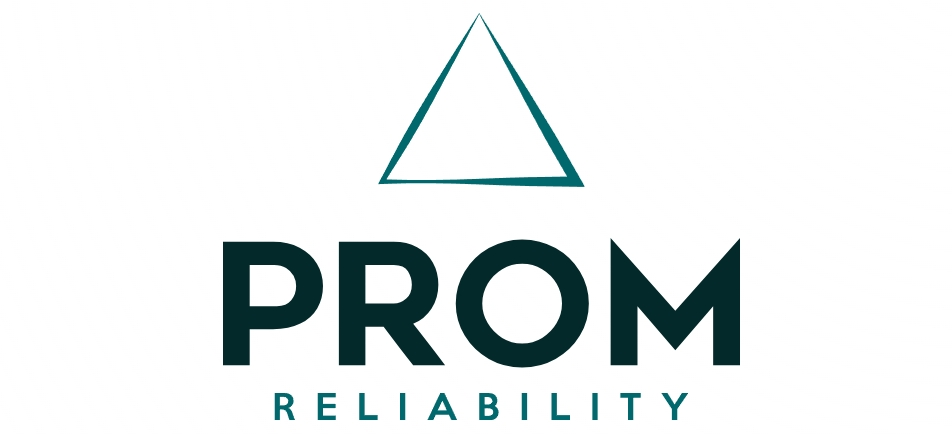

[](https://github.com/HuantWang/SUPERSONIC/graphs/commit-activity)
[](https://github.com/HuantWang/SUPERSONIC/blob/master/LICENSE)
[](https://supersonic.readthedocs.io/en/latest/?badge=latest)

<div align="center">
 
</div>
<p align="center" >
  <i>Enhance reliability during deployment</i>
</p>

<p align="center">
  <i>
    Check
    <a href="http://34.66.10.35:8098/getting_started.html">the website</a>
    for more information.
  </i>
</p>


## Introduction

PROM is  an open-source software framework to enhance the robustness and performance of predictive models against such changes during deployment.

## Installation

Prom builds upon:

-	Python 3.7 to 3.9
-	Mapie 0.8.2

The system was tested on the following operating systems:

- Ubuntu 18.04

Install the latest Prom release using:

```
pip install git+https://github.com/HuantWang/PROM.git
```


See [INSTALL.md](INSTALL.md) for further details.

## Documents

See [AE instruction](./AE.md) for a step-by-step artifact evaluation for Prom.

More detailed documents for using Prom can be checked on our [website](http://34.66.10.35:8098/getting_started.html).

## Data

Data are available at [here](./benchmark).

## Contributing

We welcome contributions to Prom. If you are interested in contributing please see
[this document](./CONTRIBUTING.md).

## Citation

If you use Prom in any of your work, please cite our paper:
~~~
@inproceedings{Prom,
      title={Enhancing Deployment-time Predictive Model Robustness for Code Analysis and Optimization},
      author={Huanting Wang, Patrick Lenihan, Zheng Wang},
      booktitle={The International Symposium on Code Generation and Optimization (CGO)},
      year={2025},
}
~~~
